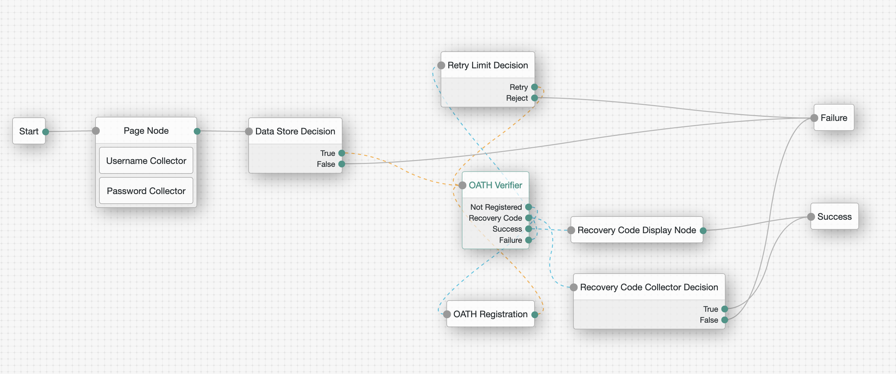

# OATH Auth Tree Node

A "simple" authentication node for ForgeRock's [Identity Platform][forgerock_platform] 6.5.0 and above. This is a node 
implementation of the ForgeRock Authenticator (OATH) auth module. It comes with 2 nodes:
- OATH Verifier
- OATH Registration

Copy the .jar file from the ../target directory into the ../web-container/webapps/openam/WEB-INF/lib directory where AM 
is deployed.  Restart the web container to pick up the new node.  The node will then appear in the authentication trees
components palette.

## Usage

The nodes' configuration is the same as the that of ForgeRock Authenticator (OATH) auth module. Make sure the matching
settings have the same value (e.g. the OTP algorithm should be the same for both)

The code in this repository has binary dependencies that live in the ForgeRock maven repository. Maven can be configured 
to authenticate to this repository by following the following
[ForgeRock Knowledge Base Article](https://backstage.forgerock.com/knowledge/kb/article/a74096897).

## Example Tree

## Disclaimer

The sample code described herein is provided on an "as is" basis, without warranty of any kind, to the fullest extent 
permitted by law. ForgeRock does not warrant or guarantee the individual success developers may have in implementing 
the sample code on their development platforms or in production configurations.

ForgeRock does not warrant, guarantee or make any representations regarding the use, results of use, accuracy, 
timeliness or completeness of any data or information relating to the sample code. ForgeRock disclaims all warranties, 
expressed or implied, and in particular, disclaims all warranties of merchantability, and warranties related to the 
code, or any service or software related thereto.

ForgeRock shall not be liable for any direct, indirect or consequential damages or costs of any type arising out of any 
action taken by you or others related to the sample code.

[forgerock_platform]: https://www.forgerock.com/platform/  
